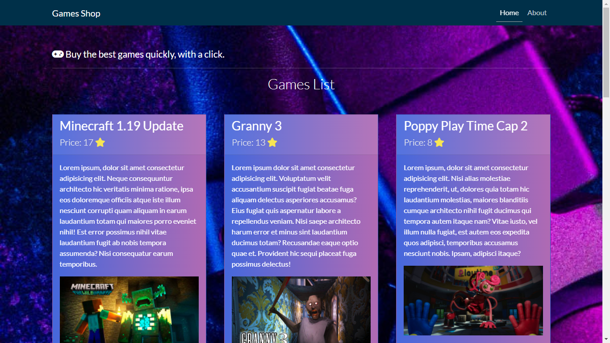

# Games Shop App.

Web Application for buy games in a shop. Made with python3 and using sqlite3 for the database.

## Manual Installation.

Create a virtual enviroment or basically install of global form using some packages manager like pip.

```bash
$ git clone https://github.com/EduardYan/games-shop-app.git

$ cd games-shop

$ pip3 install -r ./requirements.txt
```

## Configuration.

Edit the file "config.json" for set the port and if the server is running in debug mode. Also you can set the path for the sqlite database.

```json
{
  "PORT": 3000,
  "DEBUG": 1,
  "DB_PATH": "./db/buy.db"
}
```


## Running.

```bash
$ python3 main.py
```

__or__

```bash
$ ./main.py
```

Now the server with the app is running in this direction __http://localhost:YOUR_PORT_SET__

## Screenshot.
